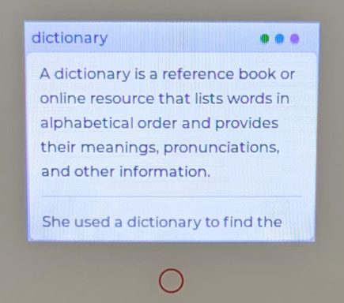

# 购买

(1) ESP32 S3 Box 3 套件
https://item.taobao.com/item.htm?id=732842971319

(2) BLE 蓝牙迷你键盘
https://item.taobao.com/item.htm?id=852619375987

(3) 18650 充电锂电池 （尖头）
https://detail.tmall.com/item.htm?id=664521581992

# 刷机（将程序安装到设备）

(1) 下载3个 bin 文件

bootloader.bin
partitions.bin
firmware.bin

也可以下载这个 [zip文件](/firmware.zip) 并解压，然后到含有三个 bin 文件的目录下。

(2) 安装 Python 3（如果没装过请参考网上教程）

(3) 安装 esptool

```sh
pip install esptool
```

(4) 刷机

连接 ESP32 S3 Box 3 到电脑，在设备管理中找到这个设备。
一般是在 Ports（串口）目录下，名为 USB JTAG/serial debug unit (Interface 0) 的设备。记下他的 COM 号，替换到下面命令中。

```sh
python -m esptool --verbose --chip esp32s3 --port <COM号> --baud 921600 --before default-reset --after hard-reset write-flash -z --flash-mode dio --flash-freq 80m --flash-size 16MB 0x0000 bootloader.bin 0x8000 partitions.bin 0x10000 firmware.bin
```

执行这个命令，你会看到：

```
esptool v5.0.1
Serial port COM23:
Connecting...
Connected to ESP32-S3 on COM23:
Chip type:          ESP32-S3 (QFN56) (revision v0.2)
Features:           Wi-Fi, BT 5 (LE), Dual Core + LP Core, 240MHz, Embedded PSRAM 16MB (AP_1v8)
Crystal frequency:  40MHz
USB mode:           USB-Serial/JTAG
MAC:                b4:3a:45:12:2e:5c

Uploading stub flasher...
Running stub flasher...
Stub flasher running.
Changing baud rate to 921600...
Changed.

Configuring flash size...
Flash will be erased from 0x00000000 to 0x00004fff...
Flash will be erased from 0x00008000 to 0x00008fff...
Flash will be erased from 0x00010000 to 0x001fdfff...
SHA digest in image updated.
Compressed 20256 bytes to 13095...
Writing at 0x00000000 [                              ]   0.0% 0/13095 bytes...
Writing at 0x00004f20 [==============================] 100.0% 13095/13095 bytes...
Wrote 20256 bytes (13095 compressed) at 0x00000000 in 0.2 seconds (784.3 kbit/s).
Hash of data verified.
Compressed 3072 bytes to 120...
Writing at 0x00008000 [                              ]   0.0% 0/120 bytes...
Writing at 0x00008c00 [==============================] 100.0% 120/120 bytes...
Wrote 3072 bytes (120 compressed) at 0x00008000 in 0.0 seconds (1493.3 kbit/s).
Hash of data verified.
Compressed 2019360 bytes to 1278133...
Writing at 0x00010000 [                              ]   0.0% 0/1278133 bytes...
Writing at 0x00057154 [==>                           ]  10.3% 131072/1278133 bytes...
Writing at 0x000fbe3d [===========>                  ]  42.3% 540672/1278133 bytes...
Writing at 0x00192e85 [======================>       ]  76.9% 983040/1278133 bytes...
Writing at 0x001fcf20 [============================> ] 100.0% 1277952/1278133 bytes...
Writing at 0x001fd020 [==============================] 100.0% 1278133/1278133 bytes...
Wrote 2019360 bytes (1278133 compressed) at 0x00010000 in 13.1 seconds (1235.5 kbit/s).
Hash of data verified.

Hard resetting via RTS pin...
```

这样说明刷机就成功了。拔掉 USB 线，后面就不需要用到电脑了。

# 初次使用

(1) 装上电池，打开电源开机。（或者按 Reset 键也可以开机）


(2) 看到主界面，拿出 BLE 蓝牙键盘，开启配对模式（按住 FN 键，再按住蓝色 BT 键，等待 3 秒开始配对）。只在初次使用时需要配对。

(3) 主界面右上角会出现蓝色圆点，说明蓝牙连接成功。

(4) 按蓝牙键盘上的 F12 键打开 WiFi 设置，等待扫描网络，选择你的 WiFi 并输入连接密码，回车确认。


(5) 这时会回到主界面，稍作等待，主界面右上角出现绿色小圆点，说明 WiFi 连接成功。

(6) 现在就可以用蓝牙键盘输入单词进行查询了。



# 关机

关机直接断开电源即可

# 再次使用

(1) 打开电源，按蓝牙键盘任意键唤醒键盘，稍等片刻待右上角三个小圆点就绪。

(2) 现在就可以输入单词查询了。

(3) 单词解释出来后可以按 F2 听单词发音，F3 听语音解释，F4 听例句。触摸屏或蓝牙键盘向下方向键可以让屏幕向下滚动。

(4) 查询单词和听音频需要连接服务器，可能网速较慢，请耐心等待。

(5) 长时间静置时蓝牙键盘会进入休眠，蓝色小圆点会变暗。如果要继续输入，按任意键唤醒键盘后，待蓝色小圆点出现后继续输入。

(6) 如网络断开，绿色小圆点会变暗。这时可以按 F12 重新扫描网络连接。

# 问题反馈

使用中如有任何问题，请到 https://github.com/liusida/dictionary_box3/issues 提交反馈。
