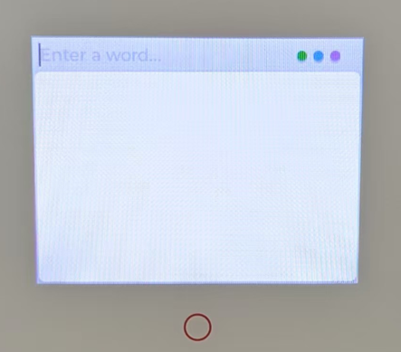

# Purchase

(1) ESP32 S3 Box 3 Kit  
`https://item.taobao.com/item.htm?id=732842971319`

(2) BLE Mini Bluetooth Keyboard  
`https://item.taobao.com/item.htm?id=852619375987`

(3) 18650 Rechargeable Li-ion Battery (button-top)
`https://detail.tmall.com/item.htm?id=664521581992`

# Flashing (install the program onto the device)

(1) Download 3 bin files

bootloader.bin  
partitions.bin  
firmware.bin

(Optional) You can also download this [zip file](/firmware.zip), unzip it, and then
cd into the folder that contains the three bin files.

(2) Install Python 3 (if you haven't, refer to an online guide)

(3) Install esptool

```sh
pip install esptool
```

(4) Flash

Connect the ESP32 S3 Box 3 to your computer and find its serial port.
Typically it appears under Ports as "USB JTAG/serial debug unit (Interface 0)".  
Note the port and substitute it into the command below.

- On Windows it looks like `COM23`  
- On macOS it looks like `/dev/tty.usbmodem*` or `/dev/tty.usbserial*`  
- On Linux it looks like `/dev/ttyACM*` or `/dev/ttyUSB*`

```sh
python -m esptool --verbose --chip esp32s3 --port <PORT> --baud 921600 --before default-reset --after hard-reset write-flash -z --flash-mode dio --flash-freq 80m --flash-size 16MB 0x0000 bootloader.bin 0x8000 partitions.bin 0x10000 firmware.bin
```

If the command runs successfully, you will see logs similar to the following:

```
esptool v5.0.1
Serial port COM23:
Connecting...
Connected to ESP32-S3 on COM23:
Chip type:          ESP32-S3 (QFN56) (revision v0.2)
Features:           Wi-Fi, BT 5 (LE), Dual Core + LP Core, 240MHz, Embedded PSRAM 16MB (AP_1v8)
Crystal frequency:  40MHz
USB mode:           USB-Serial/JTAG
MAC:                b4:3a:45:12:2e:5c

Uploading stub flasher...
Running stub flasher...
Stub flasher running.
Changing baud rate to 921600...
Changed.

Configuring flash size...
Flash will be erased from 0x00000000 to 0x00004fff...
Flash will be erased from 0x00008000 to 0x00008fff...
Flash will be erased from 0x00010000 to 0x001fdfff...
SHA digest in image updated.
Compressed 20256 bytes to 13095...
Writing at 0x00000000 [                              ]   0.0% 0/13095 bytes...
Writing at 0x00004f20 [==============================] 100.0% 13095/13095 bytes...
Wrote 20256 bytes (13095 compressed) at 0x00000000 in 0.2 seconds (784.3 kbit/s).
Hash of data verified.
Compressed 3072 bytes to 120...
Writing at 0x00008000 [                              ]   0.0% 0/120 bytes...
Writing at 0x00008c00 [==============================] 100.0% 120/120 bytes...
Wrote 3072 bytes (120 compressed) at 0x00008000 in 0.0 seconds (1493.3 kbit/s).
Hash of data verified.
Compressed 2019360 bytes to 1278133...
Writing at 0x00010000 [                              ]   0.0% 0/1278133 bytes...
Writing at 0x00057154 [==>                           ]  10.3% 131072/1278133 bytes...
Writing at 0x000fbe3d [===========>                  ]  42.3% 540672/1278133 bytes...
Writing at 0x00192e85 [======================>       ]  76.9% 983040/1278133 bytes...
Writing at 0x001fcf20 [============================> ] 100.0% 1277952/1278133 bytes...
Writing at 0x001fd020 [==============================] 100.0% 1278133/1278133 bytes...
Wrote 2019360 bytes (1278133 compressed) at 0x00010000 in 13.1 seconds (1235.5 kbit/s).
Hash of data verified.

Hard resetting via RTS pin...
```

This indicates the flashing process completed successfully. Unplug the USB cable;
you won't need the computer afterward.

# First-time Use

(1) Insert the battery and power on.  
(You can also press the Reset button to power on.)



(2) When you see the home screen, put your BLE keyboard into pairing mode  
(hold the FN key, then hold the blue BT key for about 3 seconds).  
Pairing is only required on first use.

(3) A blue dot will appear in the top-right of the home screen, indicating Bluetooth is connected.

(4) Press the F12 key on the Bluetooth keyboard to open Wi‑Fi settings. Wait for
scan results, select your Wi‑Fi, enter the password, and press Enter to confirm.


(5) You will return to the home screen. After a short wait, a green dot will appear in the top-right, indicating Wi‑Fi is connected.

(6) You can now type words to look them up.


# Power Off

To power off, simply turn off the device power.

# Using Again

(1) Turn on the power. Press any key on the Bluetooth keyboard to wake it.  
After a moment, wait until the three dots at the top-right indicate ready.

(2) You can now type a word to search.

(3) After a word is displayed, press F2 to play word pronunciation, F3 for the explanation audio, and F4 for the example sentence audio.

(4) Word lookup and audio playback require a server connection. Network speed may vary; please be patient.

(5) When idle for a long time, the Bluetooth keyboard may sleep and the blue dot
will dim. To continue typing, press any key to wake the keyboard and wait for the
blue dot to reappear before typing.

(6) If the network disconnects, the green dot will dim. Press F12 to rescan and
reconnect to Wi‑Fi.

# Feedback

If you have any issues, please file them at  
`https://github.com/liusida/dictionary_box3/issues`.


